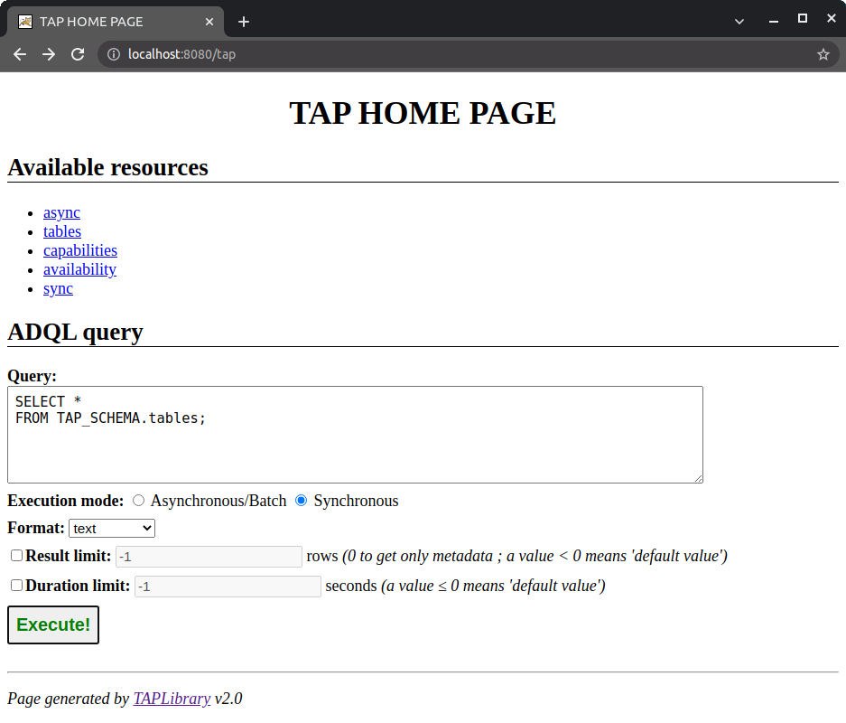
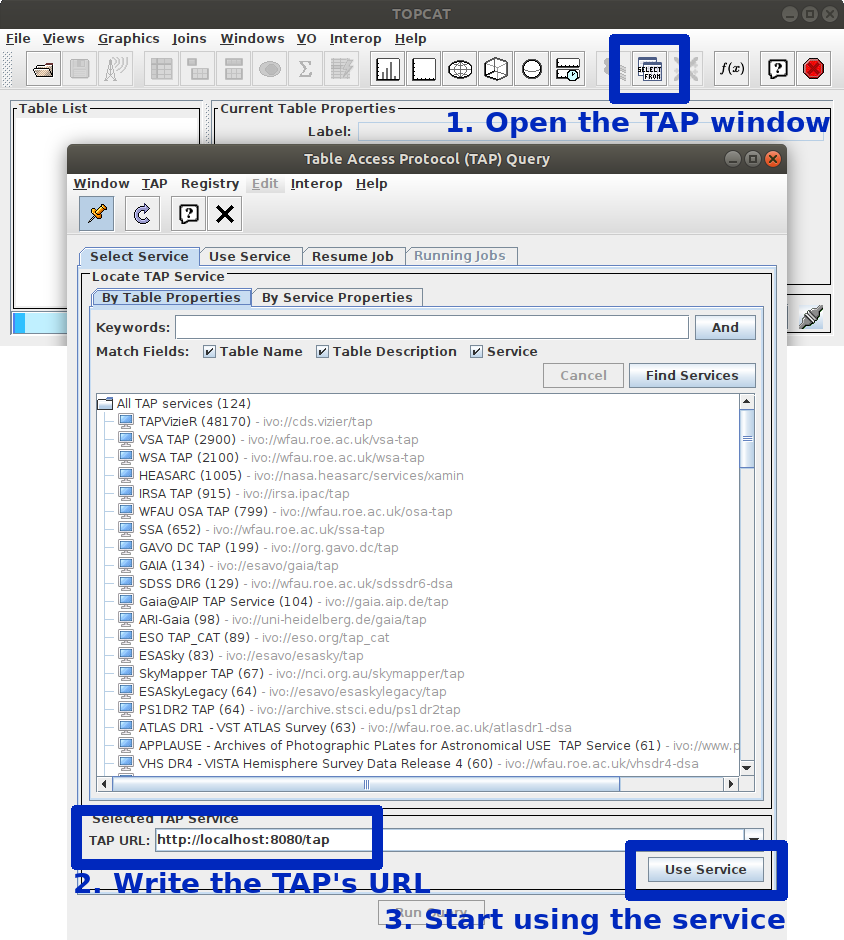

# Introduction

All files present in this directory aims to create and configure a Docker container running [VOLLT/TAP-Lib](http://cdsportal.u-strasbg.fr/taptuto/index.html). This latter is run using Apache Tomcat.

Only the TAP service is started. No database and no Web server (e.g. Apache, NginX) is started by this container.


# Get started!

0. _The following instructions are all relative to the directory containing this `README` file._

1. Configure the database connection pool inside `db-pool.env`:

   1. _Required_ Add the JDBC driver library compatible with your target database in `tomcat/shared-libs/` (or `tomcat/tap-webapp/WEB-INF/lib/`)

   2. _Required_ Database connection configuration _(here, using JNDI and the pool of connection of Tomcat)_:

      ```
      DB_TYPE=pgsphere      # Accepted: postgres, pgsphere, sqlserver, mysql
      DB_HOST=my-hostname   # Name/IP of the machine hosting the DB
                            # or 'host.docker.internal' if pointing toward a database
                            #    running in a Docker container
      DB_NAME=my-database   # Database name
      DB_USER=tapuser       # User name to use to access the DB for TAP
      DB_PASSWORD=tap1234   # Password of this user
      DB_POOL_MAX_ACTIVE=20 # [Optional] Max. number of DB conn. active in the pool
      DB_POOL_MAX_WAIT=2000 # [Optional] Max. time (ms) to wait before discarding a conn.
      ```

   3. _[Optional]_ TAP configuration inside `tap.properties`:

      The default `tap.properties` provided here is set with the default values.

      See the documentation inside this file and/or <http://cdsportal.u-strasbg.fr/taptuto/configurationfile.html> for more information about how to write this configuration file.

      Note that the following properties are automatically set by this container:

      - `database_access` = `jndi`
      - `sql_translator` to the value associated with `DB_TYPE` iin `db-pool.env`
      - `datasource_jndi_name` = `java:/comp/env/jdbc/tapdb`

      

2. Build the Docker image:

   ```bash
   scripts/build.bash
   ```

   This script will also create `scripts/start.bash` and `scripts/stop.bash`.

   

3. Start the container:

   ```bash
   scripts/run.bash
   ```

   

4. Test the TAP service in a browser or in a TAP client (e.g. TOPCAT) with the following URL:

   <http://localhost:8080/tap/>

   * _Example using a Web browser:_

     

   * _Example using TOPCAT:_

     


5. Stop the container:

```bash
scripts/stop.bash
```


6. To run again the TAP service, you have two possibilities:

   1. To create and start a new container:

      ```bash
      scripts/run.bash
      ```

      All logs, backups and result files are preserved. The configuration files will be reloaded ; so modifications of `tap.properties` and `db-pool.env` will be taken into account.

   2. To restart the previous container:

      ```bash
      docker start vollt-tap # , where 'vollt-tap' has to be the chosen container name
      ```

      All logs, backups and result files are preserved too. However, modifications of any configuration file will be ignore.


# Update the TAP configuration

0. Stop the container _if running_:

   ```bash
   scripts/stop.bash
   ```

1. Update the configuration in `db-pool.env` and/or `tap.properties`

2. Start the container using `start.bash`:

   ```bash
   scripts/run.bash
   ```


# Change the image

Here, "changing the image" mostly means updating the JAR libraries, the Tomcat configuration, updating `scripts/build.bash` or changing `Dockerfile`.

1. Stop and clean the container:

   ```bash
   scripts/clean.bash
   ```

2. Change the image _(see some examples below)_

3. Build the modified image:

   ```bash
   scripts/build.bash
   ```

## Change container/image name, version and port

The container name, image name, the version and the Tomcat's HTTP port are set when building the image.

To change one or more of them, change the corresponding variable in `scripts/build.bash`:

- `IMAGE_NAME` _(default: `vollt-tap`)_
- `CONTAINER_NAME` _(default: same as `IMAGE_NAME`)_
- `SHORT_VERSION` _(default: `0.1`)_
- `LONG_VERSION` _(default: `SHORT_VERSION` followed by `--vollt-tap-2.4beta`)_
- `TOMCAT_PORT` _(default: `8080`)_


## Add or change a JAR library

Libraries loaded in the TAP web-application are all available in `tomcat/tap-webapp/WEB-INF/lib/`. Just apply whatever modifications you want. _Note that by default, only the required libraries are provided._

The directory `tomcat/shared-libs/` contains the libraries to share among all Tomcat's web applications. Though in this container there is only a web-application, the JDBC driver for the target database has been in this directory.


## Change the Servlet configuration

Just modify the file `tomcat/tap-webapp/WEB-INF/web.xml`.

By default:

```xml
[...]
	<servlet>
        <display-name>TAP Test Service</display-name>
        <servlet-name>tap</servlet-name>
        <servlet-class>tap.config.ConfigurableTAPServlet</servlet-class>
    </servlet>
    <servlet-mapping>
        <servlet-name>tap</servlet-name>
        <url-pattern>/*</url-pattern>
    </servlet-mapping>
[...]
```


## Change the password of the Tomcat's admin

Change the file `tomcat/tomcat-users.xml`.

By default:

```xml
<tomcat-users>
	<role rolename="admin-gui"/>
	<role rolename="manager-gui"/>
	<role rolename="manager-status"/>
	<user username="admin" password="admin" roles="admin-gui,manager-gui,manager-status"/>
</tomcat-users>
```


# Docker help

```bash
# To start a container (if already created before):
docker start vollt-tap

# To stop a container:
docker stop vollt-tap

# To list active containers:
docker ps

# To list active AND inactive containers:
docker ps -a

# To see the status of a specific container:
docker ps -a -f name='vollt-tap'

# To list Docker images:
docker images

# To remove a container:
docker rm vollt-tap

# To remove an image/tag:
docker rm vollt-tap:latest vollt-tap:
```

